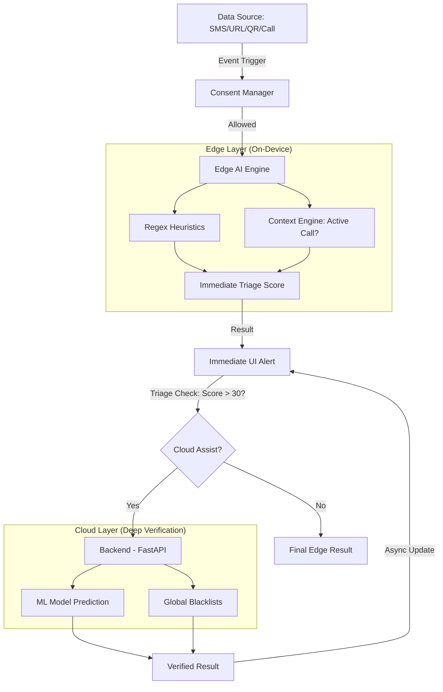

# DigiRakshak System Architecture Analysis (UPGRADED: Hybrid Edge AI)

## 1. Major Components breakdown

The DigiRakshak system is now a **Hybrid Edge AI + Cloud** architecture, distributing intelligence between the device and the server.

### **Frontend (Mobile App - Edge Layer)**
- **Framework**: React Native (Expo) with TypeScript.
- **Edge AI Engine (`edgeEngine.ts`)**: 
  - On-device Regex heuristic engine (Ported from Python).
  - Immediate Triage Scoring (Sub-10ms latency).
  - Feature extraction for Explainable AI (UX badges).
- **Behavior & Context Engine**:
  - Tracks live device state (e.g., `isCallActive`).
  - Correlates multi-vector threats (e.g., OTP SMS + Active Call).
- **Consent & Privacy Manager**:
  - User-controlled toggles for SMS/Call/Edge-AI processing.
  - Gating mechanism before any data is processed or transmitted.
- **State Management**: Zustand (`useThreatStore`) with new `consent` and `context` objects.

### **Backend (FastAPI Server - Cloud Layer)**
- **Framework**: FastAPI (Python).
- **Deep ML Verification**:
  - `InferenceEngine`: Hosts the core `fraud_model.pkl` (TF-IDF + MultinomialNB).
  - `URLClassifier`: XGBoost model for structural URL analysis.
- **Role**: Serves as an **Asynchronous Verification Layer**. Only used when Edge AI scores are uncertain or require deeper language modeling.

---

## 2. Hybrid Data Flow Mapping

The system now prioritizes **Privacy-First, Offline-Capable** analysis:

1.  **Event Ingestion**: Data arrives (SMS/Call event).
2.  **Consent Gating**: The app checks if the user has granted permission for specific processing.
3.  **Edge Analysis**: The ported TypeScript engine runs regex patterns and checks behavioral context (e.g., is the user on a call with an unknown number?).
4.  **Immediate Triage**: A score and result are generated **instantly** (offline).
5.  **Optional Cloud Verification**: If the score is medium/high, a request is sent to the Cloud for deep ML analysis.
6.  **Unified UI**: The UI updates immediately with the Edge result and then "upgrades" to a Verified result once the backend responds.

---

## 3. Hybrid ML Analysis

### **Edge Strategy (On-Device)**
- **Pattern Matching**: Urgency, scarcity, and authority keywords.
- **Behavioral Signals**: Detecting OTP requests during active calls from unknown senders.
- **Explainability**: Immediate badge generation for detected patterns.

### **Cloud Strategy (Deep Analysis)**
- **Probabilistic Modeling**: The MultinomialNB model analyzes the "vibe" and semantics of the content.
- **Structural Analysis**: Deep XGBoost features for URL lookalike detection.
- **Verification**: Cross-referencing domains against global blacklists.

---

## 4. System Characteristics (Upgraded)

| Characteristic | Status | Description |
| :--- | :--- | :--- |
| **Processing** | **Hybrid** | Lightweight heuristics on-device; Heavy ML on the server. |
| **Responsiveness** | **Immediate** | Sub-10ms UI feedback regardless of network state. |
| **Privacy** | **Gated** | Consent-based; heuristics run locally before any data leaves the device. |
| **Offline Ability** | **Functional** | Core threat detection works fully offline using Edge Heuristics. |
| **Context Awareness**| **Active** | Aware of concurrent phone calls and SMS timing. |

---

## 5. Implementation Status

- [x] **Phase 1: Logic Porting** (TypeScript Edge Engine created).
- [x] **Phase 2: Consent Layer** (Zustand state updated).
- [x] **Phase 3: Context Engine** (Call state tracking integrated).
- [x] **Phase 4: Hybrid Decision Engine** (Triage flow implemented on Dashboard/Scanner).
- [x] **Phase 5: Request Abort** (User can now cancel ongoing cloud verification).
- [ ] **Phase 6: Native Bridge** (Future: Android Native BroadcastReceiver for true real-time triggers).
