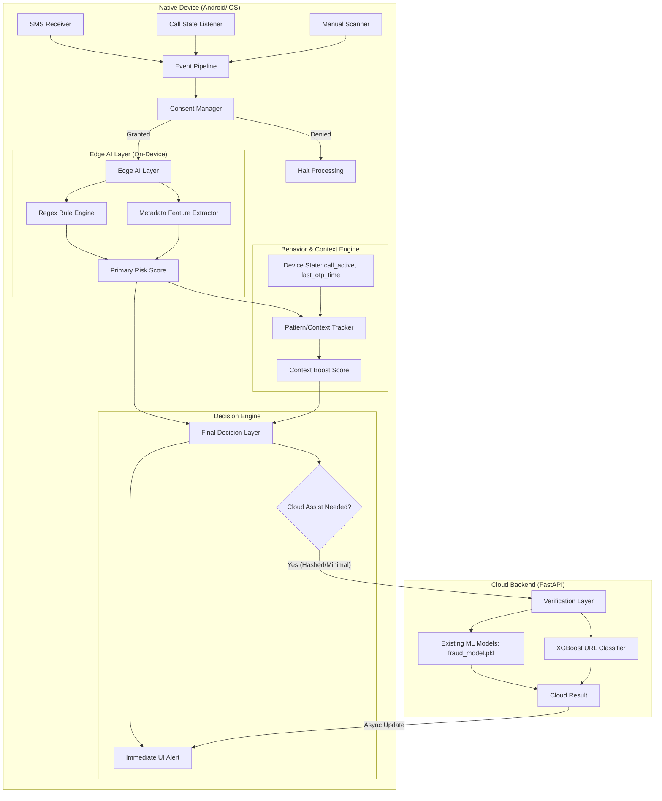

# DigiRakshak: Hybrid Edge AI + Cloud Architecture Plan

This document outlines the strategic upgrade of the DigiRakshak fraud detection system. The goal is to move critical, time-sensitive, and privacy-heavy logic to the user's device while utilizing the existing backend for deep ML verification.

---

## 1. Updated System Architecture

---

## 2. Component Responsibilities

### **On-Device (Edge)**
- **Event Capture**: Real-time listening for SMS and Call states via native hooks.
- **Privacy Enforcement**: The **Consent Manager** ensures no data leaves or stays without explicitly granted permissions.
- **Heuristic Scanning**: Ported Regex engine handles "immediate hits" (e.g., words like "URGENT", "OTP", or blacklisted domains).
- **Behavioral Context**: Correlating events (e.g., "Received an OTP SMS while on a call with an unknown number").
- **Triage**: Assigning an initial `edge_score`.

### **Cloud Backend (Remains as-is with Modified Usage)**
- **Deep ML Pipeline**: Full TF-IDF + Scikit-learn classification for text.
- **Advanced URL Analysis**: XGBoost-based phishing detection.
- **Global Intelligence**: Future updates to domain/number blacklists.

---

## 3. Migration & Implementation Steps

### **Phase 1: Porting logic to Edge (The "Quick Win")**
1.  Extract `URGENCY_PATTERNS`, `SCARCITY_PATTERNS`, and `AUTHORITY_PATTERNS` from `inference.py` to a TypeScript utility `utils/edgeEngine.ts`.
2.  Implement `calculateEdgeScore` in the frontend that mirrors the rule-based "bonus" logic from the backend.
3.  **Result**: Immediate risk labeling in the UI *before* the API call completes.

### **Phase 2: Consent & Permission Layer**
1.  Create a `ConsentScreen` or Modal using `expo-permissions` / `PermissionsAndroid`.
2.  Update `useThreatStore` to include `permissions: { sms: boolean, calls: boolean }`.
3.  Wrap all analyzer calls in a check that verifies permission before execution.

### **Phase 3: Real-time Event Pipeline**
1.  Implement a Native Android `BroadcastReceiver` (requires EAS build or Development Client).
2.  Hook `onReceive` SMS events and pass them to the `useThreatStore` via an event bridge.
3.  Implement Call State listeners to track `wasCallActiveWithin(lastMinutes)`.

### **Phase 4: Behavior & Decision Engine**
1.  **State Tracking**: Store timestamps of incoming calls and OTP-labeled SMS in memory.
2.  **Scoring Boost**: 
    - If `mode === 'sms'` and `isCallActive === true`, add **+25** to risk score.
    - If `sameSenderCount > 3` within 5 minutes, add **+15** to risk score.
3.  **Thresholds**:
    - **Score > 80**: Alert immediately; background cloud check.
    - **Score 40-80**: Show "Analyzing..." -> Call Cloud Backend.
    - **Score < 40**: Quiet scan.

---

## 4. Privacy & Security Model

To ensure a "Privacy-First" approach:
1.  **Local Redaction**: Before sending text to the backend, the Edge layer should redact potential PII (Hiding specific numbers/names but keeping keywords).
2.  **Hashed Validation**: Check URL blacklists locally via Bloom filters or simple hash-sets before querying the backend.
3.  **Consent Persistence**: Use `AsyncStorage` to store consent, ensuring it's persistent across app restarts.

---

## 5. Risks and Tradeoffs

| Risk | Impact | Mitigation |
| :--- | :--- | :--- |
| **Edge Accuracy** | Medium | The Edge AI is heuristic-based (Regex); it may have more False Positives. We use "Cloud Assist" to verify high-risk hits. |
| **Performance** | Low | Regex operations on strings are extremely fast on modern mobile CPUs. |
| **Complexity** | High | Managing async state between the immediate Edge result and the eventual Cloud result requires careful UI handling (shimmering/updates). |
| **Ecosystem** | High | Native SMS receivers on Android require standard permissions and can be restricted by OS vendors (Samsung/Xiaomi). |

---

## 6. Scalability & Production Readiness

- **Dynamic Sync**: Periodically fetch updated Regex patterns and Blacklisted domains from the backend and cache them locally (e.g., daily).
- **Graceful Degradation**: If the backend is offline, the app "fails open" to the Edge AI Layer, ensuring the user is never unprotected.
- **Explainability**: The `ReasoningCard` should clearly state if the result was found "Locally" (Ultra-fast) or "Verified by AI" (Cloud).

---

### **Immediate Next Step**
Would you like me to start by **extracting the Regex patterns** into a TypeScript utility for your `mobile/` directory, or should we focus on the **Native Event Bridge** for Android first?
